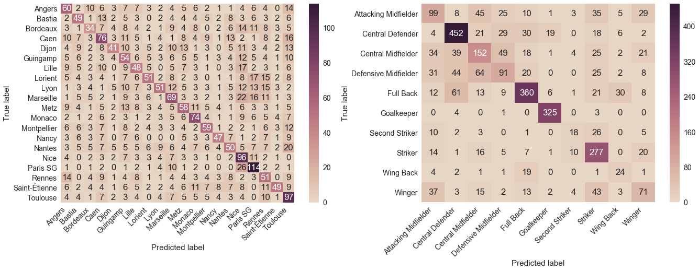
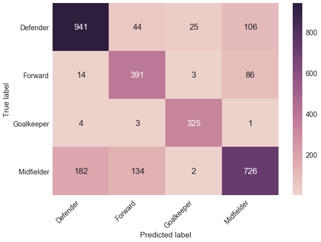
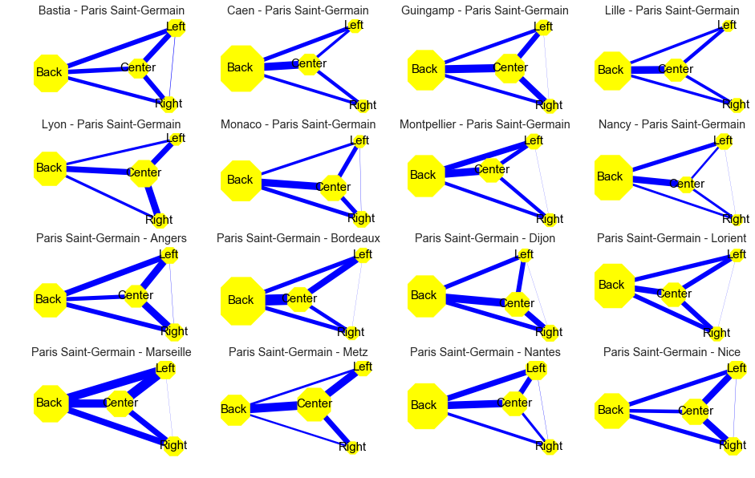

# sport_analytics_challenge
My solution to the X/PSG Sport Analytics Challenge

# Instructions

We are given a database of all the games that took place during the 1st half-season of the Ligue 1 2016/2017. Each game is described by an XML file that contains all the events relative to the two teams playing, along with timestamps, positions (X, Y), team_ids, player_ids, event_ids, outcomes and about ~300 qualifiers that describe the event with more details.

At test time, the participant is given 15 minutes of a game played during the 2nd half of the season. In the corresponding XML file, teams are anonymised and distinguished with a 1 for the team playing at home and 0 for the other one. Also, all player_ids are anonymised except one player, who is indicated with a 1 (all other players are marked as 0). The goal of the challenge is to predict :

* The player identity
* The team that will play the next event (0 or 1)
* The position of the ball at the next event 

The process is repeated thousands of times, and performances are evaluated with the accuracy for the 2 first tasks and the MSE (mean squared error) for the 3rd task.

# My approach

## Modelize the problem as a NLP problem

There are two agents speaking (the two teams), each of them will speak with some words (the events) to form some sentences (a sequence of actions without losing the ball). Eventually, the agents will consistently try to interrupt themselves (by recovering the ball) to form a new sentence.
We consider a sentence as a unbroken sequence of ball possession, either by an interruption from the opponent team, or a game event such as a goal, ball out of pitch, formation change, injury, ...

### Get the embeddings

The first step is to compute embeddings of the numerous distinct kinds of events that appear in the Opta dataset. More specifically, there are roughly ~40 different types of events, for instance Pass, Goal, Foul, Card, Out, ... each of them being also specified by different qualifiers. That is, a Shot was it a Volley ? a Lob ? a Deflection ? Followed a Dribble ? A Pass was it a Long Ball ? a Cross ? a Corner ? 
Each of these events is also specified by the pitch zone in which it took place (Left zone ? Right Zone ? Back zone ? etc...) and which body part was involved (Left foot ? Right foot ? Head ? etc...).
Finally, each event is also associated to some outcome : for instance, a Pass was it successfull ?
Based on this, we denote each event by a tuple (event type, outcome, qualifiers, body part, pitch zone), and use the MD5 hashing library to map it to a unique "word".

We get the embeddings with the Word2vec framework, in its Skip-Gram fashion. Essentially we train a Dense model to predict weither two events are likely to appear together in a same window of W = 5 events.
We generate pairs :

* (event1, event2, 1) for two events that co-appears in a 5-window 
* (event1, event2, 0) for two events that do not co-appears in a 5-window

And then train a supervised model as :

Afer tSNE reduction, the 200-dim embeddings look like this :

x |	y	| text | event_type | MD5 hash
--- | --- | --- | --- | --- 
-77.487419 | 86.249336	| attempt_saved shot shot_box_left shot_right_fo... |	Attempt Saved | bE8m6rCpF7q
65.147125	| 46.680622	| pass pass_cross pass_direct pass_fail pass_fre... |	Pass | ti4cjaxS87q
29.067633	| -124.074257	| goal goal_box_centre goal_individual_play goal... |	Goal | ILMwPMidgyc
25.560226	| -50.177837	| pass pass_2nd_assist pass_chipped pass_cross p... |	Pass | ipHTbVqq3wi
67.164398	| -1.298402	| commit_foul foul_center foul_elbow/violent_con... |	Foul | HCF9PZfgJnX

And can be plotted as this :

Different words (actions) that belong to the same type of event are nicely clustered together and one can observe that for instance, common events such as Pass and Shots are placed evenly all over the points, and Fouls and Cards are often placed in similar places, same with Tackle/Challenge/Dispossessed, ...

### The sequential action encoder

Given 15 minutes of a game, we extract all events relative to the particular player who we want to identify. For each of his events, we also consider the context in which the player did it, that it we extract the 5 events before and the 5 following events. With the pretrained embeddings, we feed the sequences into the event encoder.

The contexts are placed in a a Bidirectionnal GRU with attention mechanism, so that the network can emphasize on the surrounding events that do matter in order to understand what was the context when the player did his action. Contexts and event encoded are then concatenated in a (3, 100) tensor and fed to another Bidirectionnal GRU + Dense combinaison, which leads to the final feature map.

### The macro statistics net architecture

During the training phase, the event encoder is jointly learned with some structured features :
* Statistics computed on the team playing at home for 15 minutes, leading to 295 features
* Statistics computed on the team playing away for 15 minutes, leading to 295 features
* Statistics computed on the indiviual player for 15 minutes, leading to 284 features

Those features include attributes such as number of shots, passes, goals and percentages of succesfull outcomes, body part involved, pitch zone involved, etc etc

Network passings are also computed at the scale of the pitch zone (the exact position (X,Y) is unknown at test time), to indicate connectivity of the teams and learn some playing style associated to the different teams when they play at home or away :

### The full player net architecture

This leads to a complete architecture that looks like this :

Feature maps from macro statistics of home and away teams are subtracted in order the modelize the interaction between the two teams : final predictions are based upon both the team feature map and the interaction feature map.
The model is trained with Adam optimizer starting with learning rate 0.0005. The loss to be minimized is a linear combinaison of the cross_entropies for the the home team, the away team and the player, giving more weight to the player loss which is the attribute we really aim at predicting. Teams predictions are present in the loss in order to boost the network to learn which player belongs to which team.

### Post processing

At test time, some informations about the team are sometimes present in the dataset. That is, in the case of a formation change for instance, the team can be inferred. Is that leaking ? However, this information is precious, since we can restrict the predictions and compute the argmax on softmax distribution only on players that we know belong to the detected team. This gives a significant boost of accuracy.
Also, once we discovered which team is playing, we can also restrict the possibilities for the second team since we know which games have already been played in the first half of the season ( a same team will not play two times at home with the same opponent). This allows to restrict predictions for both teams, even when the leaked information could enable to guess only on of them.

## The next event model

The two other tasks are to predict the position (X, Y) of the next event (after the 15 minutes), and the team that will be concerned (team 1 or team 0). This time we do not have the outcome and qualifiers information for the events, but we know the position of the ball for the 10 last events.

As for the player net model, some "light" embeddings are computed on the events (light because we only know the type of event this time, not the outcome neither the qualifiers or pitch zones involved, etc). This leads to a much smaller vocabulary of about 40 words (and for this reason, the embedding dim is chosen smaller, here 50).

The architecture is a bidirectionnal GRU network, that takes as input several sequences :
* the 10 events
* the 10 positions
* an indicator that tracks weither the events were from the same team as the 10th event or not
* delta times between 2 consecutive events

A sample for this network therefoor looks like this :

events | x | y | refs | delta
--- | --- | --- | --- | ---
pass |	87.1 | 0.0 | 0	| 25
pass |	93.7 | 7.5 | 0	| 1
out |	81.2 | -1.3 |	1 |	1
out |	81.2 | -1.3 |	0 |	0
pass |	85.9 | 0.0 | 1 | 13
pass |	70.8 | 6.8 | 1 | 2
pass |	84.9 | 5.4 | 1 | 2
pass |	54.3 | 32.3 |	0	| 2
pass |	70.2 | 37.6 |	1	| 2
aerial | 59.0 |	28.2 |	1	| 1

and the target to predict is next position and a binary value that indicates weither the possession changed after the last event.

In the input dataset, positions are normalized to be directed towards the axes of attack of each team. In order to make it easier for the network to predict next position, I normalize them to be directed towards the axe of attack of the HOME TEAM. This way, there is no big jump from a position to the next one, and at test time we will just use the prediction of the team to adjust and renormalize the position if needed (ie if the predicted team is the away team).
